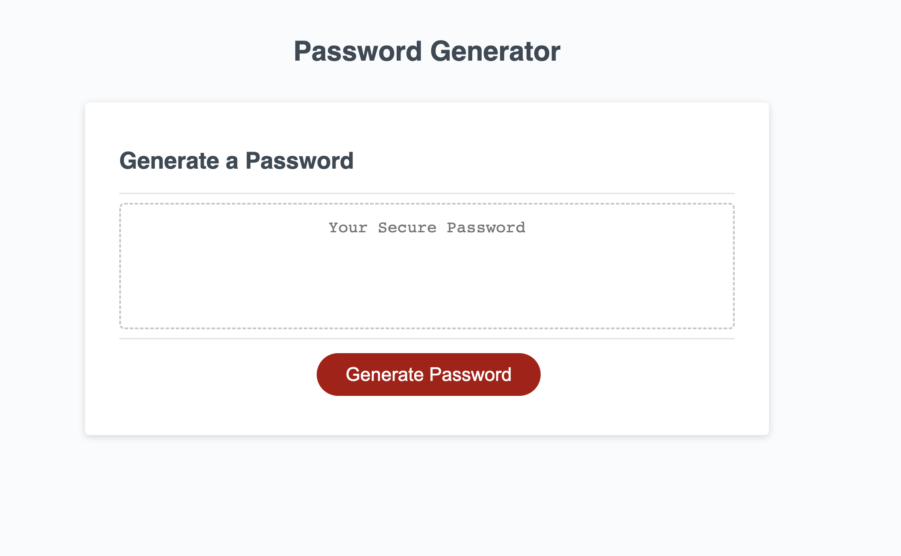

# Password Generator with User Prompts

## Description

This webpage allows users to generate a password between 8-124 characters in length. The user also has options to determine what character set they wish to include in the password:
- Lower Case Letters
- Upper Case Letters
- Numbers
- Special Characters

At least one option must be selected. 

[Password Generator](https://sam-lerner.github.io/unique-password-generator-sl// "Go to the Website!")

## Mock-Up

The following is an image of the website as it displays on load:

## Installation

N/A

## Usage

To begin generating a password, simply click the red Generate Password button at the bottom of the window. The script will then take you through the required prompts before displaying the final result in the mid-page box.

## Credits

Thank you to classmate Eric Kirberger, tutor Dru Sanchez, TAs Paul Cwik and Manoli Koutouzos for their guidance with this project. Research on the Fisher-Yates method was done through [w3docs.com](https://www.w3docs.com/snippets/javascript/how-to-randomize-shuffle-a-javascript-array.html "w3docs"). Some code copied from there.

## License

N/A

## Badges

